# Imposter Who?

A party deduction game for 3–20 players. One secret word. One liar at the table. Ask, answer, accuse — and figure out who doesn't belong.

---

## Screenshots

### Loading & Setup
| Loader | Setup screen | Players sheet |
|--------|-------------|---------------|
| 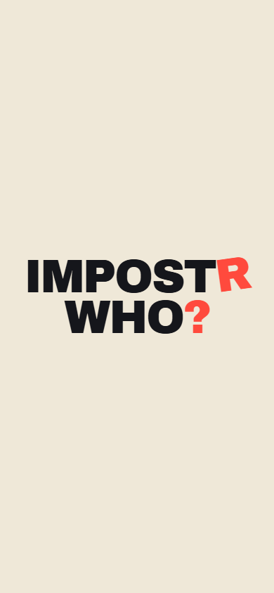 | 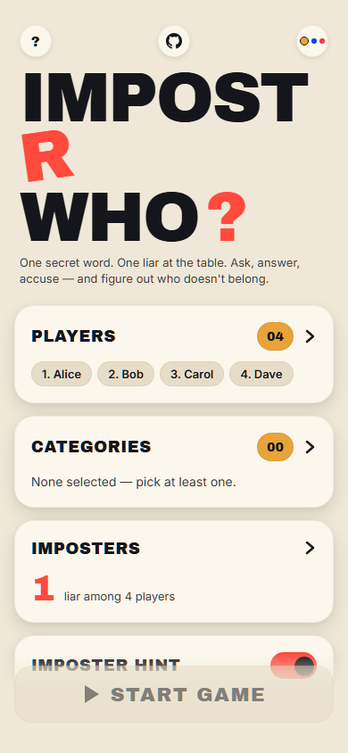 | 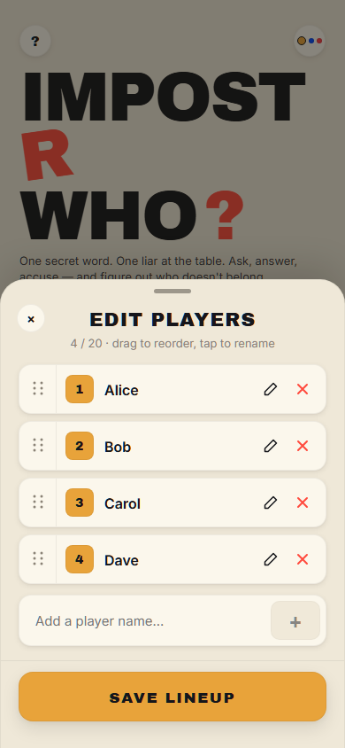 |

### Sheets
| Categories | Imposters | How To Play |
|------------|-----------|-------------|
| 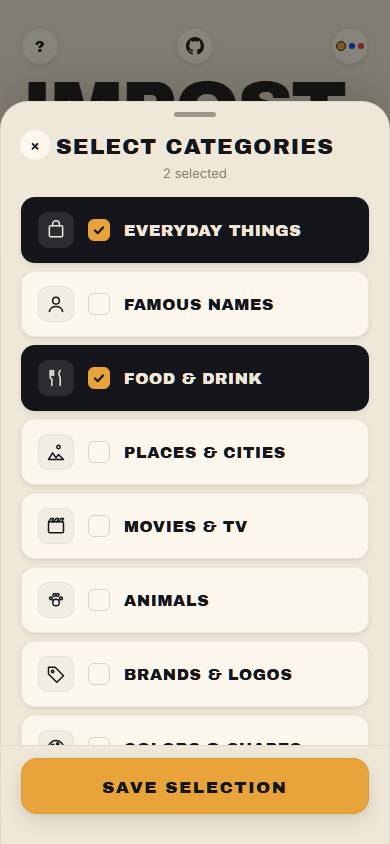 | 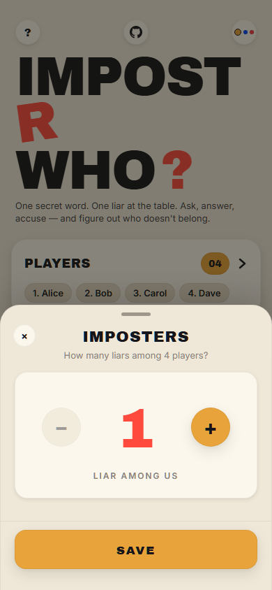 | 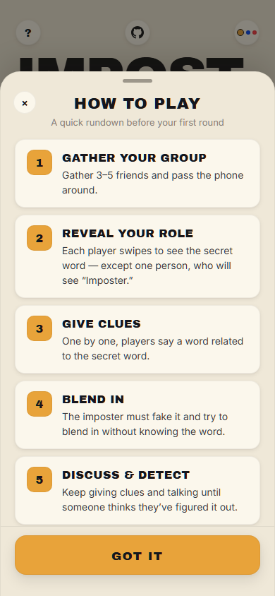 |

### Reveal Flow
| Loading word | Card front | Card back — word |
|-------------|------------|-----------------|
| 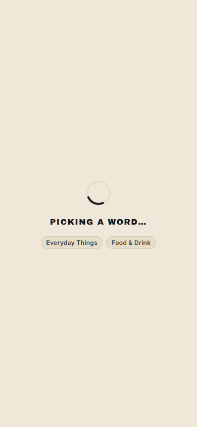 | 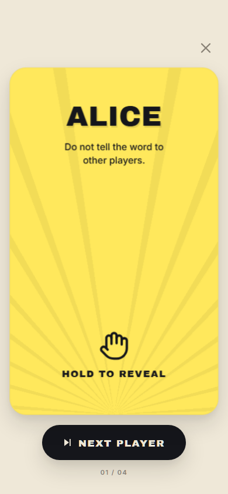 | 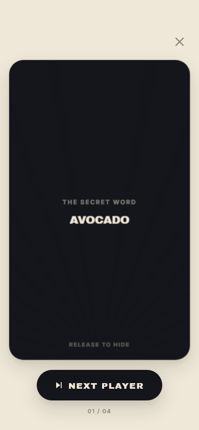 |

| Card back — imposter | Discussion | Results |
|---------------------|-----------|---------|
| 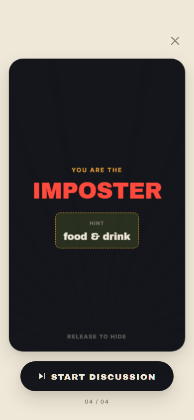 | 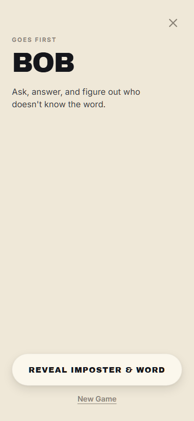 | 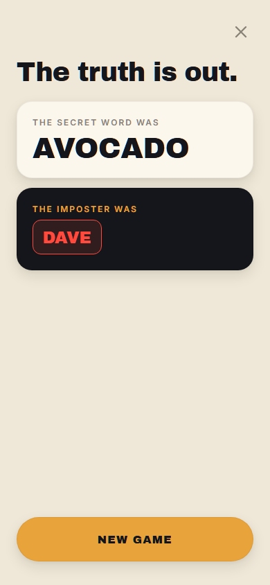 |

### Themes
| Marigold (default) | Tokyo | After Dark |
|--------------------|-------|-----------|
|  | 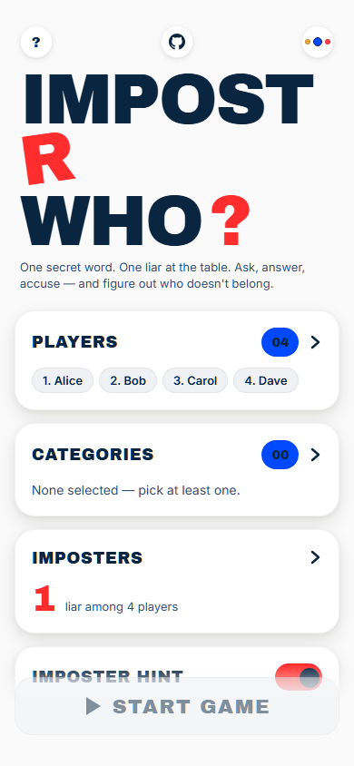 | 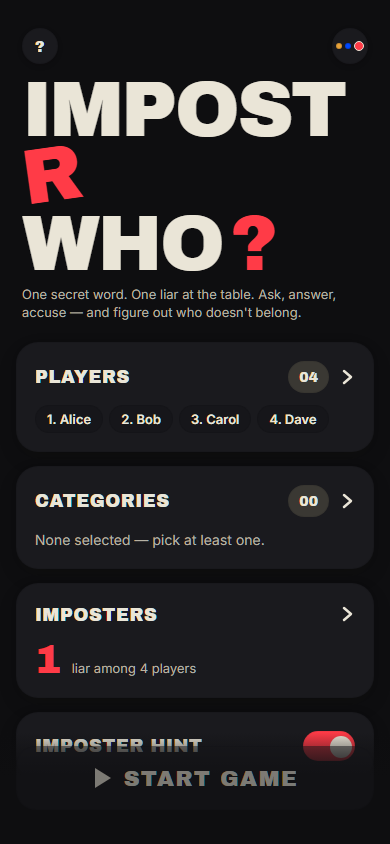 |

---

## How to Play

1. **Gather your group** — pass the phone around the table, one player at a time.
2. **Each player holds to reveal their card** — everyone sees the secret word except the imposter, who sees `IMPOSTER` and a fuzzy hint clue.
3. **Go around the table** — each player says one word or phrase related to the secret word. The imposter must bluff.
4. **Discuss** — talk, question each other, look for the person whose clue felt slightly off.
5. **Vote** — agree on who you think the imposter is.
6. **Reveal** — tap **Reveal Imposter & Word** to see if you were right.

The imposter wins if they survive the vote without being identified. Everyone else wins if they correctly identify the imposter.

---

## Features

### Four-Tier AI Word Engine

Every round a fresh word + hint is generated by AI. The client tries each server in order and shows live status if one fails:

| Tier | Model | Limit |
|------|-------|-------|
| 1 | Groq qwen3-32b | 14,400 req/day |
| 2 | Ollama Cloud gemma3:4b | Free |
| 3 | OpenRouter gpt-oss-120b:free | Free |
| 4 | Gemini 2.0 Flash | 1,500 req/day |
| 5 | Hardcoded list (~490 words) | Offline fallback |

### The Two-Test Hint Rule

The hint given to the imposter must be **widely known** (not trivia) and **not the defining property** of the word (not an instant giveaway). Both must hold.

- `clock → ticking` fails — too iconic.
- `shark → cartilage` fails — too obscure.
- `clock → round` passes — obvious but fits hundreds of things.
- `candle → drips` passes — everyone knows it, doesn't scream candle.

Hints must also be a direct physical or behavioural property, not a cultural reference or brand association.

### Fair Imposter Rotation

The game tracks who has been imposter and rotates through all players before repeating anyone. The cycle resets once everyone has had a turn.

### Per-Player Word History

Seen words are stored per player. Before each round the app sends the union of all current players' histories to the AI so the same word is never repeated — even across partial group changes.
